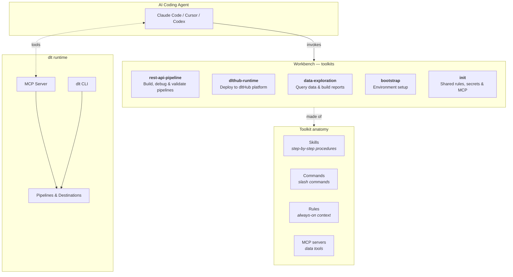

# dltHub AI Workbench

AI-assisted data engineering with [dlt](https://dlthub.com). Give your coding agent the skills to build, debug, and explore data pipelines.

Works with **Claude Code**, **Cursor**, and **Codex**.

## How to get started

### Via Anthropic plugin (cold start)

If you don't have dlt or Python set up yet:

1. Add the marketplace in Claude Code: `https://github.com/dlt-hub/dlthub-ai-workbench`
!- ADD EXACT CLAUDE CODE COMMAND HERE

2. Install the bootstrap toolkit:
   ```
   claude plugin install bootstrap@dlthub-ai-workbench --scope project
   ```
3. Run `/init-workspace` — it installs `uv`, creates a Python venv, installs `dlt`, and sets up AI agent support with `dlt ai init`.

### Via `dlt` (existing project)

If you already have a Python project:

```bash
uv pip install --upgrade dlt[workspace]==1.23.0a1
dlt ai init
```

`dlt ai init` auto-detects your coding agent (Claude Code, Cursor, or Codex) and installs shared rules, secrets handling, and the workspace MCP server.

Then install your first toolkit:

```bash
dlt ai toolkit list                           # see what's available
dlt ai toolkit rest-api-pipeline install      # install one
```

### Codex setup
Codex does not support commands and rules so we convert those into skills. Codex runs in pretty strict sandbox mode. You should consider giving access
to fetch web pages in your project or global config ie.
`.codex/config.toml`
```toml
web_search = "live"
```


## What is workbench

Workbench is a catalog of **toolkits** that teach AI coding agents how to work with [dlt](https://dlthub.com). It is backward compatible with the Anthropic (and Cursor) marketplace and plugin system.

Each toolkit is an ordered group of **skills**, **commands**, **rules**, and **MCP servers**. A **workflow** rule ties them together into a guided sequence — the agent knows which skill to use at each step.



### Toolkits

| Toolkit | Description | Components |
|---------|-------------|------------|
| **rest-api-pipeline** | End-to-end REST API ingestion | 8 skills, workflow, MCP |
| **dlthub-runtime** | Deploy pipelines to dltHub platform | 2 skills, workflow, rules |
| **data-exploration** | Interactive data analysis and reporting | 2 skills |
| **bootstrap** | Cold-start environment setup | 1 command |
| **init** | Shared rules, secrets handling, workspace MCP | installed by `dlt ai init` |

### rest-api-pipeline workflow

The workflow guides the agent through a complete pipeline build:

| Step | Skill | What it does |
|------|-------|-------------|
| 0 | `find-source` | Discover a dlt source for your API |
| 1 | `create-rest-api-pipeline` | Scaffold pipeline code and configure credentials |
| 2 | `debug-pipeline` | Run, inspect traces and load packages, fix errors |
| 3 | `validate-data` | Check schema and data, fix types and structures |
| 4 | `adjust-endpoint` | Production-ready: pagination, incremental loading, schema hints |
| 5 | `new-endpoint` | Add more API endpoints to the pipeline |
| 6 | `view-data` | Query and explore loaded data |

### data-exploration skills (WIP!)

| Skill | What it does |
|-------|-------------|
| `explore-data` | Query loaded data with the dlt dataset API and ibis |
| `create-marimo-report` | Build interactive marimo notebooks with charts and filters |

## How to use

### Option A: `dlt ai` command line

The `dlt ai` CLI manages toolkits and agent configuration. It auto-detects your coding agent and installs components in the right format.
When you use this option, toolkits become part of your workspace so **you can customize and hack them**. This follows the same philosophy
as our verified sources.

```bash
dlt ai init                                    # set up agent support
dlt ai toolkit list                            # list available toolkits
dlt ai toolkit <name> info                     # show toolkit contents
dlt ai toolkit <name> install [--agent] [--overwrite]
dlt ai secrets list                            # show secret file locations
dlt ai secrets view-redacted [--path <file>]   # print secrets with values masked
dlt ai secrets update-fragment --path <file> '<toml>'  # merge TOML into secrets file
dlt ai mcp run [--stdio | --sse] [--features ...]
dlt ai mcp install [--agent] [--features ...] [--name]
```

Agent auto-detection and install paths:

| | Claude Code | Cursor | Codex |
|---|---|---|---|
| Skills | `.claude/skills/` | `.cursor/skills/` | `.agents/skills/` |
| Commands | `.claude/commands/` | `.cursor/commands/` | converted to skills |
| Rules | `.claude/rules/` | `.cursor/rules/` | converted to skills |
| MCP | `.mcp.json` | `.cursor/mcp.json` | `.codex/config.toml` |

### Option B: Anthropic marketplace and plugins

Workbench toolkits are standard Claude Code plugins. You can browse and install them directly from the Anthropic marketplace in Claude Code — no `dlt` CLI needed.

1. Add the marketplace: `https://github.com/dlt-hub/dlthub-ai-workbench`
2. Boostrap `dlthub` Workspace. Use `dlt ai init` to get workspace rules.
3. Browse and install toolkits as plugins
4. Skills and commands appear in your agent immediately

This is the easiest path for Claude Code users who want to get started without touching the terminal.

### MCP server

Toolkits that need data access use the **dlt MCP server** — a read-only interface to your pipelines and destinations, installed automatically with each toolkit.

The MCP server uses a pluggy-based feature system. The `workspace` and `pipeline` features are built into dlt. External packages (like `dlt-mcp`) can add more features (e.g. `search-docs`) via `plug_mcp` hookimpls — see [dlt-mcp#30](https://github.com/dlt-hub/dlt-mcp/issues/30).

## Add and maintain Toolkits
See [CLAUDE](CLAUDE.md)

## License

[Elastic License 2.0](LICENSE) — use, modify, and distribute freely. Cannot be offered as a hosted/managed service.
