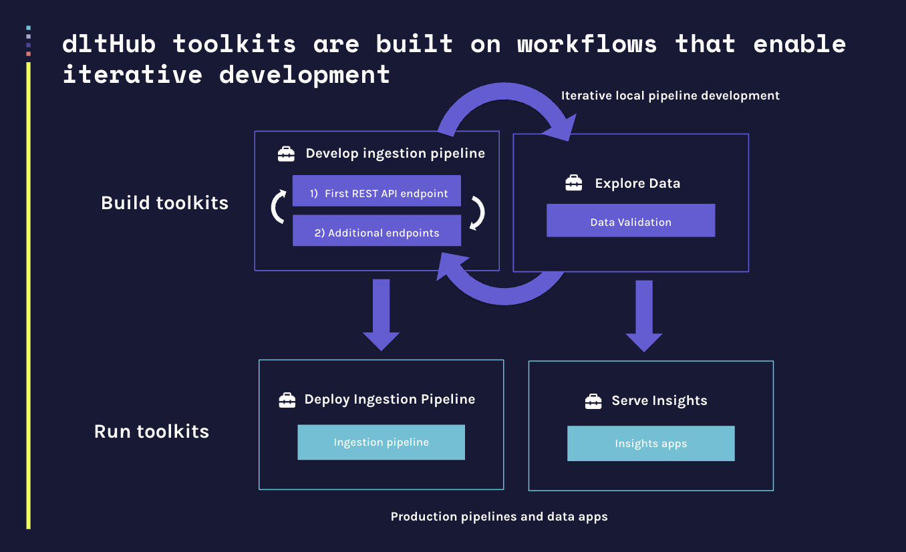
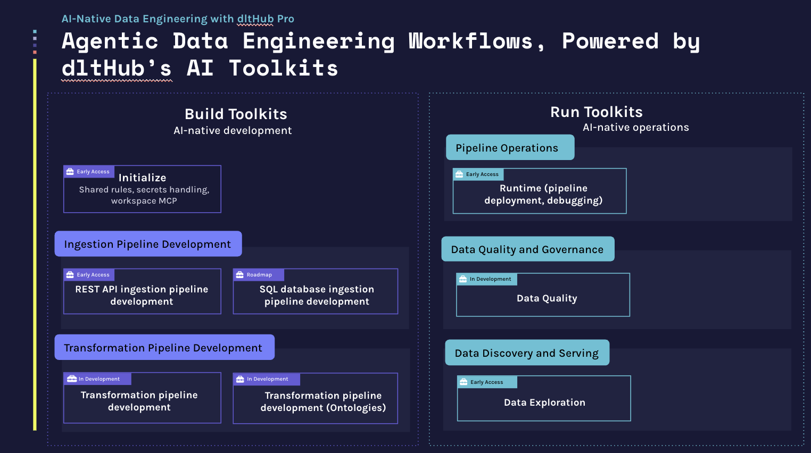

# dltHub AI Workbench

**dlt** (data load tool) is an open-source Python library for loading data from APIs and databases into a warehouse or lakehouse. **dltHub** (paid platform) extends dlt with enterprise-grade features: transformations, data quality validation, managed runtime infrastructure, managed data apps, and an AI-powered workspace environment.

The **dltHub AI Workbench** is a collection of toolkits that give AI coding assistants the knowledge and step-by-step workflows to build data pipelines with dlt. Each toolkit covers a specific phase of the data engineering lifecycle — ingesting from a REST API, exploring loaded data, or deploying to dltHub — and guides the assistant through it in a defined sequence. You can use the workbench as-is or fork and customize it for your own stack. The **dlt ai CLI** builds the bridge between the workbench and your coding assistant by handling the installation of toolkit components into the right locations for your assistant, and by running the MCP server that the assistant uses during a session.

The dltHub AI Workbench is tested with **Claude Code**, **Cursor**, and **Codex** and may work with other AI coding assistants. We recommend workings in `accept edits` (Claude) / `--approval-mode` (Codex) mode to review the changes and familiarizing with dlthub AI workflows when getting started with the dlthub AI workbench.

## The dlthub AI workbench supports the iterative data engineering workflow

Building data pipelines is iterative and covers two major phases — **ingestion** and **transformation** — each following the same inner loop:

**Build loop (local development)**
- Develop the pipeline iteratively — for ingestion: first REST API endpoint, then additional endpoints; for transformation: data model first, then the full transformation pipeline
- Explore the loaded data and validate it after each step
- Loop back to refine until the pipeline is solid

**Run (production)**
- Deploy the ingestion or transformation pipeline to production
- Serve insights via data apps built on top of the loaded data

The outer loop connects the two phases: insights from the transformation and serving layer feed back into ingestion refinement. The workbench **Build toolkits** support the local development loop; the **Run toolkits** handle deployment and data apps.



## The AI Workbench

The workbench gives your coding assistant **toolkits** — that contain a structured, guided workflow for a specific phase. Instead of generating ad-hoc code, the assistant follows a defined sequence of steps from start to finish. 

A **Toolkit** contains skills, commands, rules, and an MCP server — tied together by a **workflow** that tells the assistant which skill to run at each step and how to leverage the MCP. 

All toolkits depend on `init` for shared rules, secrets handling, and the MCP server. When using the `dlt ai` CLI, `init` is installed automatically as a dependency. When using the Claude marketplace, install the `init` plugin separately.



### Workbench components

| Component | What it is | When it runs |
|-----------|-----------|-------------|
| **Skill** | Step-by-step procedure the assistant follows | Triggered by user intent or explicitly with `/skill-name` |
| **Command** | A slash command for a specific action | User invokes with `/toolkit:command` |
| **Rule** | Always-on context (conventions, constraints) | Every session, automatically |
| **Workflow** | Ordered sequence of skills with a fixed entry point | Loaded as a rule — always active |
| **MCP server** | Exposes pipelines, tables, and secrets as tools | During a session, via MCP protocol |


### Available toolkits

| Toolkit | Phase | Workflow entry | What it does | Example prompts |
|---------|-------|---------------|-------------|---------------|
| `bootstrap` | Setup | `/init-workspace` | Checks for `uv`, Python venv, and `dlt`; installs what's missing; then runs `dlt ai init` and lists available toolkits | *"Run /init-workspace to set up a Python environment with dlt"* |
| `rest-api-pipeline` | Build | `find-source` | Scaffold, debug, and validate REST API ingestion pipelines | *"Use find-source to load data from the Stripe API into DuckDB"* |
| `dlthub-runtime` | Run | `setup-runtime` | Deploy pipelines to the dltHub platform | *"Use setup-runtime to deploy my pipeline to dltHub"* |
| `data-exploration` | Explore | `explore-data` | Query loaded data and create marimo dashboards | *"Use explore-data to show me what's in the orders table"* |

> `init` is a shared dependency that provides rules, secrets handling, and the MCP server. It is installed automatically by `dlt ai init` or as a separate plugin via the Claude marketplace.


## Getting started

> **Note:** All `dlt ai` commands below use `uv run dlt ...` syntax. If you have `dlt` installed globally or in an active virtual environment, you can omit `uv run` and call `dlt` directly.

### Claude Code

For Claude Code, we recommmend installing the dlthub AI workbench via the Claude marketplace. If you want to modify the content of the plugin to adapt it to your workflow, you can follow the [installation steps for Cursor and Codex](#cursor-codex-copilot--via-dlt-ai-cli) below.

#### Installation

Start a Claude Code session in your terminal via `claude`.

Inside the Claude session, add the marketplace:
```
/plugin marketplace add dlt-hub/dlthub-ai-workbench
```

Install the `init` plugin first — it provides shared rules, secrets handling, and the MCP server config:
```
/plugin install init@dlthub-ai-workbench --scope project
```

Install the toolkits you want to use (if you are not sure which one to install we recommend installing all of them):
```
/plugin install bootstrap@dlthub-ai-workbench --scope project
/plugin install rest-api-pipeline@dlthub-ai-workbench --scope project
/plugin install dlthub-runtime@dlthub-ai-workbench --scope project
/plugin install data-exploration@dlthub-ai-workbench --scope project
```

Start a new session — plugins take effect only after restarting Claude Code: `claude`

For the MCP server to run, `uv` and `dlt` must be installed on your machine. If you don't have them yet, install `bootstrap` first and run `/init-workspace` before starting a new session.

> **No Python environment yet?** The `bootstrap` toolkit (installed above) sets up `uv`, Python, and `dlt` for you — run `/init-workspace` to get started.

> **Resuming a session?** Plugins installed mid-session are not active until you start a new one. Previous sessions can be resumed, but the new toolkit skills will only be available in sessions started after installation.

#### Recommended CLAUDE.md additions

Add the following to your `CLAUDE.md` to enforce safe credential handling:

```markdown
CRITICAL: never ask for credentials in chat. Always let the user edit secrets directly and do not attempt to read them.
```

#### Starting the workbench

Once installed, start a new Claude Code session via `claude` in your terminal and use one of the example prompts from the [Available toolkits](#available-toolkits) table above to kick off a workflow.


### Cursor and Codex — via `dlt ai` CLI

The dltHub AI workbench does not yet support the Cursor marketplace. Installation for Cursor and Codex works via the `dlt ai` CLI.

#### Installation

```bash
# Install uv (fast Python package manager) if you don't have it
curl -LsSf https://astral.sh/uv/install.sh | sh

# Install dlt with workspace support
uv pip install --upgrade "dlt[workspace]"

# Set up your workspace (auto-detects your coding assistant)
uv run dlt ai init

# If multiple coding assistants are detected, specify one explicitly:
uv run dlt ai init --agent <agent>  # <agent>: claude | cursor | codex
```

`dlt ai init` detects your coding assistant from environment variables and config files, then installs skills, rules, and the MCP server in the correct locations for that tool.

> **Cursor note:** After running the command, manually enable the dlt-workspace-mcp server in **Cursor Settings > MCP**.

> **Codex note:** Codex does not support commands and rules, so the installer converts those into skills and AGENTS.md. Codex also runs in a strict sandbox — consider enabling web access in your project or global config:
> ```toml
> # .codex/config.toml
> web_search = "live"
> ```

**Browse and install toolkits**  

Browse available toolkits:

```bash
uv run dlt ai toolkit list
```

Install toolkits (if you are not sure which toolkits to install we recommend installing all of them):

```bash
uv run dlt ai toolkit bootstrap install
uv run dlt ai toolkit rest-api-pipeline install
uv run dlt ai toolkit dlthub-runtime install
uv run dlt ai toolkit data-exploration install
```


#### Starting the workbench

Use one of the example prompts from the [Available toolkits](#available-toolkits) table above to kick off a workflow.

**Cursor** — open the project in Cursor and use the chat panel (Cmd+L) to talk to the assistant. The installed skills and rules are picked up automatically. Add the following to your `.cursor/rules/security.mdc` to enforce safe credential handling:

```markdown
CRITICAL: never ask for credentials in chat. Always let the user edit secrets directly and do not attempt to read them.
```

**Codex** — either launch the Codex CLI in your terminal via `codex` or use the Codex chat in the UI. Skills are available in both modes. The Codex CLI picks up the MCP server automatically; in the Codex UI you need to copy the MCP configuration manually. Restart Codex after setup for the MCP server to take effect. Add the following to your `AGENTS.md` to enforce safe credential handling:

```markdown
CRITICAL: never ask for credentials in chat. Always let the user edit secrets directly and do not attempt to read them.
```


## The `dlt ai` CLI

The `dlt ai` subcommand is the bridge between the workbench and your coding assistant. `dlt ai init` installs project rules, a secrets management skill, appropriate ignore files, and configures the dlt MCP server for your agent. `dlt ai toolkit install` copies additional toolkit components (skills, rules, commands) into the right locations for your assistant.

**Toolkit management** — copies skills, rules, commands, and MCP config from the workbench into your project's agent config directory (`.claude/`, `.cursor/`, `.agents/`, etc.):

```bash
uv run dlt ai status                        # show installed agent, dlt version, active toolkits
uv run dlt ai toolkit list                  # list available toolkits from the workbench
uv run dlt ai toolkit <name> info           # show a toolkit's skills, commands, and workflow
uv run dlt ai toolkit <name> install        # install a toolkit for the detected agent
uv run dlt ai toolkit <name> install --agent <agent>  # <agent>: claude | cursor | codex  - override agent detection
```

**Secrets management** — dlt stores credentials in TOML files; these commands let the assistant inspect and update them without reading raw secret values:

```bash
uv run dlt ai secrets list                  # show which secret files exist and where
uv run dlt ai secrets view-redacted         # print secrets with values masked
uv run dlt ai secrets update-fragment --path <file> '<toml>'  # merge a TOML snippet into a secrets file
```

**MCP server** — starts a local server that exposes your dlt workspace (pipelines, schemas, tables, secrets) as tools the assistant can call:

```bash
uv run dlt ai mcp run                       # run in SSE mode (default)
uv run dlt ai mcp run --stdio               # run in stdio mode (for assistants that require it)
uv run dlt ai mcp install                   # register the MCP server in the agent's config
```

The MCP server is what allows the assistant to answer questions like "what tables were loaded?" or "show me the last pipeline trace" without you having to copy-paste output into the chat.

## License

TO BE UPDATED
