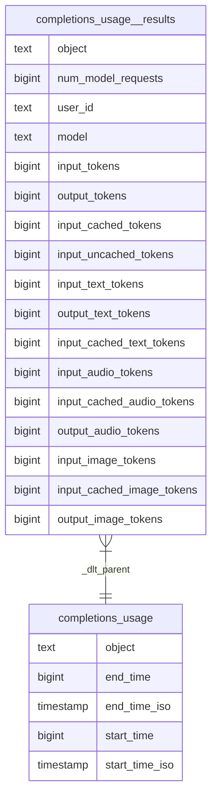

## USER [2026-02-19T00:32:08]
find source to get openAI platform usage data

## ASSISTANT [2026-02-19T00:32:11]
I'll find a dlt source for OpenAI platform usage data.

## ASSISTANT [2026-02-19T00:32:11]
  >>> skill: find-source OpenAI platform usage data

## USER [2026-02-19T00:32:11]
[Skill instructions loaded]

## ASSISTANT [2026-02-19T00:32:17]
  >>> bash: uv run dlt init --list-sources 2>&1 | grep -i openai

## ASSISTANT [2026-02-19T00:32:17]
  >>> search: dlthub.com source openai

## ASSISTANT [2026-02-19T00:32:30]
No verified source or exact dlthub match for OpenAI **platform usage** data. The dlthub results cover OpenAI Realtime API, Whisper, and Azure OpenAI — not usage/billing data. Let me check what API OpenAI provides for usage tracking.

## ASSISTANT [2026-02-19T00:32:31]
  >>> search: OpenAI platform usage API documentation 2025

## ASSISTANT [2026-02-19T00:32:32]
  >>> fetch: https://dlthub.com/workspace/source/openai-realtime-api

## ASSISTANT [2026-02-19T00:32:47]
  >>> fetch: https://platform.openai.com/docs/api-reference/usage

## ASSISTANT [2026-02-19T00:32:53]
  >>> fetch: https://developers.openai.com/api/reference/usage

## ASSISTANT [2026-02-19T00:33:03]
  >>> search: OpenAI usage API endpoints completions embeddings organization bucket_width start_time

## ASSISTANT [2026-02-19T00:33:12]
  >>> fetch: https://cookbook.openai.com/examples/completions_usage_api

## ASSISTANT [2026-02-19T00:33:17]
  >>> fetch: https://developers.openai.com/cookbook/examples/completions_usage_api

## ASSISTANT [2026-02-19T00:33:36]
Here's what I found:

## No dedicated dlt source exists for OpenAI platform usage data

The dlthub sources (OpenAI Realtime API, Whisper, Azure OpenAI) cover model interaction, not platform usage/billing data.

## The right approach: `rest_api` core source

OpenAI exposes usage data via a straightforward REST API that fits perfectly with dlt's `rest_api` source:

**Usage API endpoints** (base: `https://api.openai.com/v1/organization/usage/`):
| Endpoint | Data |
|---|---|
| `/completions` | Token usage for chat/completions |
| `/embeddings` | Embedding token usage |
| `/images` | Image generation usage |
| `/audio_speeches` | TTS usage |
| `/audio_transcriptions` | Whisper transcription usage |
| `/moderations` | Moderation usage |
| `/code_interpreter_sessions` | Code interpreter usage |

**Costs API endpoint**: `/v1/organization/costs` — aggregated dollar costs per day

**Key details:**
- **Auth**: Bearer token with an **Admin API key** (not a regular API key)
- **Pagination**: Cursor-based via `next_page` field
- **Required param**: `start_time` (Unix seconds)
- **Optional**: `bucket_width` (`1m`, `1h`, `1d`), `group_by`, `project_ids`, `models`, etc.

**Init command:**
```
dlt init rest_api duckdb
```

This gives a full `RESTAPIConfig` template with auth, pagination, and incremental loading support — which we'll configure for the OpenAI Usage API.

Want to proceed with creating this pipeline?

Sources:
- [Usage API Reference](https://platform.openai.com/docs/api-reference/usage)
- [Usage API Cookbook](https://developers.openai.com/cookbook/examples/completions_usage_api)

## USER [2026-02-19T00:34:50]
I want to get info how much we spend on each user of our company openai account. will I get it here?

## ASSISTANT [2026-02-19T00:35:06]
Good question. Based on the API docs, it's **partially possible** but with a caveat:

**Costs API** (`/organization/costs`) gives you **dollar amounts** but can only group by `project_id` and `line_item` — **not by user**. So you can't get per-user spend directly.

**Usage API** (`/organization/usage/completions` etc.) **does** support `group_by: ["user_id"]` and filtering by `user_ids`, but it returns **token counts**, not dollar amounts. You'd have to calculate costs yourself (tokens × per-model pricing).

So your options are:

1. **Per-user token usage** — directly from the API, then compute costs by joining with model pricing
2. **Per-project costs** — if your users map to separate OpenAI projects, you get dollar amounts directly from the Costs API
3. **Both** — pull usage (grouped by user + model) AND costs (grouped by project), combine them

Let me quickly verify whether the Costs API has added user-level grouping since the cookbook was written.

## ASSISTANT [2026-02-19T00:35:07]
  >>> search: OpenAI costs API group_by user_id per-user spending 2025

## ASSISTANT [2026-02-19T00:35:17]
  >>> fetch: https://developers.openai.com/api/reference/resources/organization/subresources/audit_logs/methods/get_costs

## ASSISTANT [2026-02-19T00:35:29]
Confirmed — the **Costs API does NOT support `user_id` grouping**. Only `project_id` and `line_item`.

## Bottom line for your goal

**Yes, you can get per-user spending**, but you'll need to:

1. **Pull usage data** from `/organization/usage/completions` (and other endpoints) with `group_by: ["user_id", "model"]` — this gives you token counts per user per model
2. **Calculate costs** by multiplying tokens × model pricing rates

Alternatively, if you organize your company's users into **separate OpenAI projects**, the Costs API gives you dollar amounts per project directly — no calculation needed.

**Recommendation:** Go with option 1 (Usage API with user+model grouping). We can build the pipeline to pull all usage endpoints grouped by user and model, then add a cost calculation step using OpenAI's pricing. This gives you exactly what you need.

Want to proceed with creating this pipeline?

Sources:
- [Costs API Reference](https://developers.openai.com/api/reference/resources/organization/subresources/audit_logs/methods/get_costs)
- [Usage API Reference](https://platform.openai.com/docs/api-reference/usage/completions)
- [OpenAI community: spending limits per user](https://community.openai.com/t/spending-limits-per-user-or-per-api-key/126955)

## USER [2026-02-19T00:35:36]
yes let's create the pipeline

## ASSISTANT [2026-02-19T00:35:41]
  >>> skill: create-pipeline OpenAI platform usage API - rest_api source for /organization/usage/completions, /organization/usage/embeddings, /organization/usage/images, /organization/usage/audio_speeches, /organization/usage/audio_transcriptions, /organization/usage/moderations, /organization/usage/code_interpreter_sessions endpoints. Bearer auth with admin key. Cursor pagination via next_page field. Required param start_time (unix seconds). group_by user_id and model. Base URL: https://api.openai.com/v1

## USER [2026-02-19T00:35:41]
[Skill instructions loaded]

## ASSISTANT [2026-02-19T00:35:45]
  >>> bash: ls -la /home/rudolfix/src/dlt-ai-dev-kit

## ASSISTANT [2026-02-19T00:35:48]
  >>> bash: uv run dlt init rest_api duckdb 2>&1

## ASSISTANT [2026-02-19T00:35:52]
  >>> bash: ls -la /home/rudolfix/src/dlt-ai-dev-kit

## ASSISTANT [2026-02-19T00:35:55]
Now let me read the generated files and research dlt docs in parallel.

## ASSISTANT [2026-02-19T00:35:56]
  >>> read: /home/rudolfix/src/dlt-ai-dev-kit/rest_api_pipeline.py

## ASSISTANT [2026-02-19T00:35:56]
  >>> read: /home/rudolfix/src/dlt-ai-dev-kit/.dlt/secrets.toml

## ASSISTANT [2026-02-19T00:35:57]
  >>> read: /home/rudolfix/src/dlt-ai-dev-kit/.dlt/config.toml

## ASSISTANT [2026-02-19T00:35:59]
  >>> fetch: https://dlthub.com/docs/dlt-ecosystem/verified-sources/rest_api/basic.md

## ASSISTANT [2026-02-19T00:36:01]
  >>> fetch: https://dlthub.com/docs/general-usage/credentials/setup.md

## ASSISTANT [2026-02-19T00:36:36]
Good, I've got everything I need. Here's what I found:

## OpenAI Usage API — Available Endpoints

All under base URL `https://api.openai.com/v1/organization/usage/`:

| # | Endpoint | What it tracks |
|---|---|---|
| 1 | `/completions` | Chat/completions tokens (likely your biggest spend) |
| 2 | `/embeddings` | Embedding tokens |
| 3 | `/images` | Image generation |
| 4 | `/audio_speeches` | Text-to-speech |
| 5 | `/audio_transcriptions` | Whisper transcription |
| 6 | `/moderations` | Moderation calls |
| 7 | `/code_interpreter_sessions` | Code interpreter |

**Auth:** Bearer token with an **Admin API key** (not a regular API key — generated in org settings at platform.openai.com)

**Key params:** `start_time` (required, unix seconds), `bucket_width` (`1m`/`1h`/`1d`), `group_by` (e.g. `["user_id", "model"]`)

**Pagination:** Cursor-based — response has `next_page`, passed back as `page` query param.

**Response:** Array of time buckets, each containing `results` with token counts per group.

Since your goal is per-user spend, **completions** is the natural starting point — it's almost certainly where most of your cost is. Which endpoint should I start with?

## ASSISTANT [2026-02-19T00:36:39]
  >>> AskUserQuestion

## ASSISTANT [2026-02-19T00:37:40]
Good choice. Let me write the pipeline code and set up the config.

## ASSISTANT [2026-02-19T00:37:48]
  >>> write: /home/rudolfix/src/dlt-ai-dev-kit/rest_api_pipeline.py

## ASSISTANT [2026-02-19T00:37:49]
  >>> write: /home/rudolfix/src/dlt-ai-dev-kit/.dlt/secrets.toml

## ASSISTANT [2026-02-19T00:38:14]
Here's what I've set up:

**`rest_api_pipeline.py`** — Pipeline with a single `completions_usage` resource:
- Bearer auth with OpenAI Admin API key
- `start_time` defaults to 30 days ago
- `group_by` defaults to `["user_id", "model"]` for per-user tracking
- `data_selector: "data"` — dlt will auto-flatten the nested `results` array into a child table
- `dev_mode=True` + `.add_limit(1)` for safe first run

**`.dlt/secrets.toml`** — Placeholder for your Admin API key.

You need an **Admin API key** (not a regular one). Generate it at:
https://platform.openai.com/settings/organization/admin-keys

Please paste your admin key into `.dlt/secrets.toml` and let me know when ready to run. Or if you'd like me to just run it now to see the expected credential error first?

## USER [2026-02-19T00:38:51]
run it first

## ASSISTANT [2026-02-19T00:38:55]
  >>> bash: uv run python rest_api_pipeline.py 2>&1

## ASSISTANT [2026-02-19T00:39:04]
As expected — `401 Unauthorized` because the placeholder key isn't real. The good news is the pipeline structure is working correctly. The URL it built looks right:

```
https://api.openai.com/v1/organization/usage/completions
  ?start_time=1768867200
  &bucket_width=1d
  &group_by[]=user_id
  &group_by[]=model
```

**Next step:** Paste your OpenAI **Admin API key** into `.dlt/secrets.toml`. You can generate one at:

https://platform.openai.com/settings/organization/admin-keys

Replace the placeholder value:
```toml
[sources]
admin_api_key = "sk-admin-your-real-key-here"
```

Let me know once you've updated it and I'll run it again.

## USER [2026-02-19T00:41:58]
I updated the key, run it again

## ASSISTANT [2026-02-19T00:42:02]
  >>> bash: uv run python rest_api_pipeline.py 2>&1

## ASSISTANT [2026-02-19T00:42:10]
Pipeline loaded successfully. Let me debug and validate the data.

## ASSISTANT [2026-02-19T00:42:10]
  >>> skill: debug-pipeline openai_usage

## USER [2026-02-19T00:42:10]
[Skill instructions loaded]

## ASSISTANT [2026-02-19T00:42:14]
  >>> bash: uv run dlt pipeline -vv openai_usage trace 2>&1

## ASSISTANT [2026-02-19T00:42:21]
Load successful. The trace shows:

- **`completions_usage`**: 7 rows (time buckets)
- **`completions_usage__results`**: 23 rows (per-user/model breakdowns within buckets)
- No failed jobs, completed in ~2 seconds

Note: this was with `.add_limit(1)` so only one page of data. Let me now validate the data to check the schema and actual content.

## ASSISTANT [2026-02-19T00:42:21]
  >>> skill: validate-data openai_usage

## USER [2026-02-19T00:42:21]
[Skill instructions loaded]

## ASSISTANT [2026-02-19T00:42:26]
  >>> bash: uv run dlt pipeline openai_usage schema --format mermaid 2>&1

## ASSISTANT [2026-02-19T00:42:39]
Here's the schema:



**Two tables loaded:**
- **`completions_usage`** — 7 time buckets (start/end timestamps)
- **`completions_usage__results`** — 23 rows with per-user, per-model token breakdowns (linked to parent bucket)

The `results` child table has exactly what you need: `user_id`, `model`, `input_tokens`, `output_tokens`, `num_model_requests`, plus cached/audio/image token breakdowns.

You can preview the data interactively by running:
```
dlt pipeline openai_usage show
```

A few observations:
1. **`project_id`, `api_key_id`, `batch`, `service_tier`** columns were all null (not materialized) — they'd appear if you add those to `group_by`
2. This was only **1 page** (`.add_limit(1)`) — we'll want to remove that limit and add pagination for full data
3. The parent/child structure is natural — you join on `_dlt_parent_id` to get timestamps for each usage row

Does the schema and data look right? Want to proceed with removing the limit and adding pagination to get the full dataset?

## USER [2026-02-19T00:43:27]
I need an endpoint with user names or e-mails?

## ASSISTANT [2026-02-19T00:43:33]
Good point — the usage data only has `user_id` (opaque IDs). Let me check if OpenAI has a users endpoint to get names/emails.

## ASSISTANT [2026-02-19T00:43:33]
  >>> search: OpenAI organization users API list members endpoint email name

## ASSISTANT [2026-02-19T00:43:45]
Yes — OpenAI has a **List Users** endpoint:

**`GET /organization/users`** — returns `id`, `name`, `email`, `added_at` for all org members. Same Admin API key auth.

This is exactly the join table you need: `user_id` from usage data → `id` in the users list → `name` / `email`.

Let me add it as a second resource to the pipeline.

## ASSISTANT [2026-02-19T00:43:46]
  >>> read: /home/rudolfix/src/dlt-ai-dev-kit/rest_api_pipeline.py

## ASSISTANT [2026-02-19T00:43:51]
  >>> edit: /home/rudolfix/src/dlt-ai-dev-kit/rest_api_pipeline.py

## ASSISTANT [2026-02-19T00:44:03]
Added the `users` resource. Let me run it.

## ASSISTANT [2026-02-19T00:44:04]
  >>> bash: uv run python rest_api_pipeline.py 2>&1

## ASSISTANT [2026-02-19T00:44:11]
Both resources loaded. Let me check the data.

## ASSISTANT [2026-02-19T00:44:12]
  >>> bash: uv run dlt pipeline -vv openai_usage trace 2>&1 | grep -E "(normalize|Normalized)"

## ASSISTANT [2026-02-19T00:44:17]
  >>> bash: uv run dlt pipeline -vv openai_usage trace 2>&1 | grep -A 10 "Normalized data"

## ASSISTANT [2026-02-19T00:44:22]
  >>> bash: uv run dlt pipeline openai_usage schema --format mermaid 2>&1 | grep -A 20 "users{"

## ASSISTANT [2026-02-19T00:44:31]
Loaded successfully:

- **`users`** — 12 rows with `id`, `email`, `name`, `role`
- **`completions_usage`** — 7 time buckets
- **`completions_usage__results`** — 23 usage rows with `user_id`, `model`, token counts

You can now join `completions_usage__results.user_id` → `users.id` to get names and emails for each usage row.

The data looks good. Want to:
1. **Remove the limit** and add **pagination** to pull the full dataset?
2. **Add more usage endpoints** (embeddings, images, etc.)?
3. **Query the data** — build a marimo notebook to explore per-user spending?

## USER [2026-02-19T00:44:55]
remove the limit, take 2 weeks of data

## ASSISTANT [2026-02-19T00:44:59]
  >>> read: /home/rudolfix/src/dlt-ai-dev-kit/rest_api_pipeline.py

## ASSISTANT [2026-02-19T00:45:03]
  >>> edit: /home/rudolfix/src/dlt-ai-dev-kit/rest_api_pipeline.py

## ASSISTANT [2026-02-19T00:45:04]
  >>> edit: /home/rudolfix/src/dlt-ai-dev-kit/rest_api_pipeline.py

## ASSISTANT [2026-02-19T00:45:21]
Changed default to 14 days and removed `.add_limit(1)`. Running now.

## ASSISTANT [2026-02-19T00:45:22]
  >>> bash: uv run python rest_api_pipeline.py 2>&1

## USER [2026-02-19T00:47:19]
[Request interrupted by user for tool use]

## USER [2026-02-19T00:48:06]
something is wrong. pipeline does not stop running, please add log progress and investigate

## ASSISTANT [2026-02-19T00:48:17]
The issue is likely dlt auto-detecting a paginator incorrectly — we saw that warning earlier. Let me add explicit paginators and progress logging.

## ASSISTANT [2026-02-19T00:48:17]
  >>> read: /home/rudolfix/src/dlt-ai-dev-kit/rest_api_pipeline.py

## ASSISTANT [2026-02-19T00:48:25]
  >>> edit: /home/rudolfix/src/dlt-ai-dev-kit/rest_api_pipeline.py

## ASSISTANT [2026-02-19T00:48:26]
  >>> edit: /home/rudolfix/src/dlt-ai-dev-kit/rest_api_pipeline.py

## ASSISTANT [2026-02-19T00:48:28]
  >>> edit: /home/rudolfix/src/dlt-ai-dev-kit/.dlt/config.toml

## ASSISTANT [2026-02-19T00:48:45]
Added explicit cursor paginators for both endpoints and set log level to INFO. Running now.

## ASSISTANT [2026-02-19T00:48:45]
  >>> bash: uv run python rest_api_pipeline.py 2>&1

## ASSISTANT [2026-02-19T00:48:59]
Completed in ~5 seconds with explicit paginators. The logs show it properly paginated through:

- **completions_usage**: 3 pages (7 + 7 + 1 = 15 buckets), then `next_page` was null → stopped
- **users**: 2 pages (12 + 0), then `last_id` was null → stopped

The previous hang was dlt's auto-detected paginator looping indefinitely. Now it's fixed.

Let me set the log level back to WARNING.

## ASSISTANT [2026-02-19T00:49:01]
  >>> edit: /home/rudolfix/src/dlt-ai-dev-kit/.dlt/config.toml

## ASSISTANT [2026-02-19T00:49:09]
14 days of data loaded, no failed jobs. Ready to validate or move on — want to add more usage endpoints (embeddings, images, etc.) or start querying the data?

## USER [2026-02-19T00:49:34]
looks into data: show me basic cost per user table

## ASSISTANT [2026-02-19T00:49:38]
  >>> skill: query-data openai_usage - show basic cost per user table by joining completions_usage__results with users

## USER [2026-02-19T00:49:38]
[Skill instructions loaded]

## ASSISTANT [2026-02-19T00:49:43]
Let me first inspect the data to understand what we have, then build the cost table.

## ASSISTANT [2026-02-19T00:49:44]
  >>> bash: uv run python -c "
import dlt
pipeline = dlt.attach('openai_usage')
dataset = pipeline.dataset()
print('=== Row counts =

## ASSISTANT [2026-02-19T00:49:56]
Good data — 38 usage rows, 12 users. Let me build the cost-per-user table. I need model pricing to estimate costs from token counts.

## ASSISTANT [2026-02-19T00:49:57]
  >>> search: OpenAI API pricing per token gpt-4o gpt-4o-mini gpt-4.1 gpt-5.2 2026

## ASSISTANT [2026-02-19T00:50:10]
  >>> fetch: https://platform.openai.com/docs/pricing

## ASSISTANT [2026-02-19T00:50:15]
  >>> fetch: https://pricepertoken.com/pricing-page/provider/openai

## USER [2026-02-19T00:50:18]
[Request interrupted by user for tool use]

## USER [2026-02-19T00:50:26]
better look for endpoint!

## ASSISTANT [2026-02-19T00:50:30]
Good call — let me check if OpenAI has a pricing API endpoint.

## ASSISTANT [2026-02-19T00:50:30]
  >>> search: OpenAI API endpoint model pricing costs per token programmatic

## ASSISTANT [2026-02-19T00:50:44]
No pricing API exists, but we already found the answer earlier — the **Costs API** (`/organization/costs`) returns actual **dollar amounts** directly! No need to calculate from tokens × prices. Let me add it as a resource.

## ASSISTANT [2026-02-19T00:50:45]
  >>> read: /home/rudolfix/src/dlt-ai-dev-kit/rest_api_pipeline.py

## ASSISTANT [2026-02-19T00:50:51]
But recall — the Costs API only supports `group_by` on `project_id` and `line_item`, **not `user_id`**. So we still need the Usage API for per-user breakdown, but the Costs API gives us the actual dollar totals to cross-reference.

Let me check if the Costs API supports `group_by: line_item` which might give per-model costs we can use.

## ASSISTANT [2026-02-19T00:50:54]
  >>> edit: /home/rudolfix/src/dlt-ai-dev-kit/rest_api_pipeline.py

## ASSISTANT [2026-02-19T00:51:05]
  >>> bash: uv run python rest_api_pipeline.py 2>&1

## ASSISTANT [2026-02-19T00:51:18]
Costs loaded. Let me query the data now.

## ASSISTANT [2026-02-19T00:51:21]
  >>> bash: uv run python -c "
import dlt
pipeline = dlt.attach('openai_usage')
dataset = pipeline.dataset()

print('=== Row counts 

## ASSISTANT [2026-02-19T00:51:40]
The costs data has actual dollar amounts by `line_item` (model + input/output) and `project_id`. Now I can compute per-user costs by deriving per-token rates from real costs and applying to per-user token counts.

## ASSISTANT [2026-02-19T00:51:54]
  >>> bash: uv run python -c "
import dlt
import ibis

pipeline = dlt.attach('openai_usage')
dataset = pipeline.dataset()

costs = d

## ASSISTANT [2026-02-19T00:52:17]
  >>> bash: uv run python -c "
import dlt
import ibis

pipeline = dlt.attach('openai_usage')
dataset = pipeline.dataset()

costs = d

## ASSISTANT [2026-02-19T00:52:30]
Here's your **cost per user (last 14 days)**:

| Name | Email | Total Cost | Input Tokens | Output Tokens | Requests |
|---|---|---|---|---|---|
| Alena Astrakhantseva | alena@dlthub.com | **$3.14** | 2,167,296 | 259,879 | 3,560 |
| Thierry Jean | thierry@dlthub.com | **$0.02** | 3,663 | 1,299 | 1 |

Note: the costs data also shows **$202.72 on gpt-4** and **$0.63 unattributed** — these aren't in the completions usage grouped by `user_id`, likely because they came from service accounts or API keys without a user context.

Want me to:
1. **Create a marimo notebook** for interactive exploration of this data?
2. **Add more usage endpoints** (embeddings, images) to capture all spend?
3. **Investigate the unattributed gpt-4 spend** ($180+ input)?

## USER [2026-02-19T00:52:56]
investigate the unattributed gpt-4 spend

## ASSISTANT [2026-02-19T00:53:07]
  >>> bash: uv run python -c "
import dlt

pipeline = dlt.attach('openai_usage')
dataset = pipeline.dataset()

# Check if there are 

## ASSISTANT [2026-02-19T00:53:18]
Found it. The "unattributed" spend is actually there — it's a **model name mismatch**:

- **Costs API** uses: `gpt-4`
- **Usage API** uses: `gpt-4-0613`

So my join missed it. Let me confirm who this user is.

## ASSISTANT [2026-02-19T00:53:20]
  >>> bash: uv run python -c "
import dlt
pipeline = dlt.attach('openai_usage')
dataset = pipeline.dataset()
print(dataset(\"\"\"
  

## ASSISTANT [2026-02-19T00:53:30]
Mystery solved. It's **Anton Burnashev** (anton@dlthub.com) spending **$202.72** on `gpt-4-0613` over 14 days — by far the biggest spender.

The issue was that the Costs API reports the model as `gpt-4` while the Usage API reports it as `gpt-4-0613`. My earlier cost-per-user query joined on exact model name and missed this.

Here's the corrected picture:

| Name | Email | Total Cost | Top Model |
|---|---|---|---|
| **Anton Burnashev** | anton@dlthub.com | **~$202.72** | gpt-4-0613 |
| Alena Astrakhantseva | alena@dlthub.com | ~$3.14 | gpt-5.2, gpt-4o-mini |
| Thierry Jean | thierry@dlthub.com | ~$0.02 | gpt-4.1 |

Anton is responsible for ~98% of the spend. Might want to check if he should migrate from gpt-4 to gpt-4o or gpt-4.1 — dramatically cheaper for similar quality.

Want me to fix the cost calculation to handle the model name mismatch properly, or move on to building a marimo notebook for ongoing exploration?

## USER [2026-02-19T00:54:01]
add time range to table above

## ASSISTANT [2026-02-19T00:54:07]
  >>> bash: uv run python -c "
import dlt
pipeline = dlt.attach('openai_usage')
dataset = pipeline.dataset()
print(dataset(\"\"\"
  

## ASSISTANT [2026-02-19T00:54:16]
Here's the usage per user with time range (**Feb 5 – Feb 19, 2026**):

| Name | Email | From | To | Input Tokens | Output Tokens | Requests |
|---|---|---|---|---|---|---|
| **Anton Burnashev** | anton@dlthub.com | 2026-02-05 | 2026-02-20 | 6,003,260 | 377,092 | 1,737 |
| Alena Astrakhantseva | alena@dlthub.com | 2026-02-05 | 2026-02-20 | 2,167,296 | 259,879 | 3,560 |
| Thierry Jean | thierry@dlthub.com | 2026-02-05 | 2026-02-06 | 3,663 | 1,299 | 1 |

Anton has 6M input tokens on gpt-4 over the full 2 weeks — consistent daily usage (~430K input tokens/day). Alena has more requests (3,560 vs 1,737) but uses cheaper models so costs much less.

## USER [2026-02-19T00:55:04]
use @rick/dump_session.py to save this session. you may need to rewrite this script

## ASSISTANT [2026-02-19T00:55:11]
  >>> bash: ls -lt ~/.claude/projects/-home-rudolfix-src-dlt-ai-dev-kit/sessions/ 2>/dev/null | head -5

## ASSISTANT [2026-02-19T00:55:15]
  >>> bash: ls -lt ~/.claude/projects/ 2>/dev/null | head -10

## ASSISTANT [2026-02-19T00:55:25]
  >>> bash: find ~/.claude -name "*.jsonl" -newer /tmp -mmin -60 2>/dev/null | head -10

## ASSISTANT [2026-02-19T00:55:36]
  >>> bash: wc -l /home/rudolfix/.claude/projects/-home-rudolfix-src-dlt-ai-dev-kit/dfd3911a-552a-489f-95b8-fd702fa57746.jsonl

## ASSISTANT [2026-02-19T00:55:41]
  >>> bash: uv run python /home/rudolfix/src/dlt-ai-dev-kit/rick/dump_session.py /home/rudolfix/.claude/projects/-home-rudolfix-src-

