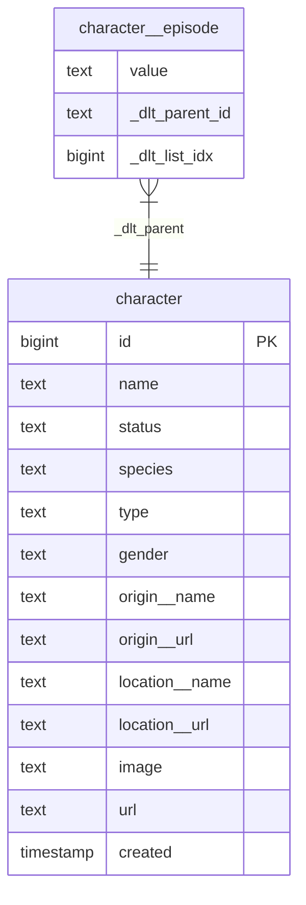

## USER [2026-02-18T23:09:21]
what skills do you see here? and rules? do not scan any files

## ASSISTANT [2026-02-18T23:09:30]
## Skills Available

1. **find-source** — Find a dlt source for a given API or data provider
2. **create-pipeline** — Create a dlt REST API pipeline
3. **debug-pipeline** — Debug and inspect a dlt pipeline after running it
4. **validate-data** — Validate schema and data after a successful pipeline load
5. **add-endpoint** — Add a new REST API endpoint/resource to an existing pipeline
6. **add-pipeline-mcp** — Set up a dlt pipeline MCP server to query schemas and data
7. **explore-data** — Create a marimo notebook for interactive data exploration

There are also some non-dlt skills:
- **keybindings-help** — Customize keyboard shortcuts
- **claude-developer-platform** — Build programs using the Claude API/Anthropic SDK
- **notion-to-diagrams** — Create HTML architecture diagrams from Notion documents

## Rules

Two rule files are loaded:

1. **`workflow.md`** — Defines the core pipeline workflow sequence:
   - Find source → Create pipeline → Debug pipeline → Validate data → Add endpoints → Add incremental loading → Explore data
   - Includes cross-references for how skills connect (e.g., after debug, move to validate; if config errors, check credentials from create step)

2. **`bootstrap.md`** — Setup and working conventions:
   - Use `uv` for Python/venv management, always `uv run`
   - Install `dlt[workspace]` if needed
   - Expect a `WHY.md` with business context; ask user if missing
   - Use web search extensively, study docs
   - dlt docs at `https://dlthub.com/docs/llms.txt`
   - Use CLI to inspect pipelines post-mortem
   - Set up MCP for querying schemas/data

## USER [2026-02-18T23:09:52]
do you have ricky and morty source? what's in it?

## ASSISTANT [2026-02-18T23:10:00]
Let me check what's in the current `ricky` project directory.

## ASSISTANT [2026-02-18T23:10:01]
  >>> bash: ls -la /home/rudolfix/src/dlt-ai-dev-kit/ricky

## ASSISTANT [2026-02-18T23:10:06]
The `ricky` directory is essentially empty — just a `.claude` config folder, no pipeline code yet.

There's no existing Rick and Morty source in this project. However, the [Rick and Morty API](https://rickandmortyapi.com) is a well-known public REST API with endpoints for **characters**, **locations**, and **episodes**. It requires no authentication, which makes it straightforward to build a dlt pipeline for.

Would you like me to use the **find-source** skill to check if there's a pre-built dlt source for it, or jump straight to **create-pipeline** to scaffold one?

## USER [2026-02-18T23:10:24]
find the source

## ASSISTANT [2026-02-18T23:10:27]
  >>> skill: find-source Rick and Morty API

## USER [2026-02-18T23:10:27]
[Skill instructions loaded]

## ASSISTANT [2026-02-18T23:10:32]
Let me search for a Rick and Morty source in dlt.

## ASSISTANT [2026-02-18T23:10:33]
  >>> bash: uv run dlt init --list-sources 2>&1 | grep -i "rick\|morty"

## ASSISTANT [2026-02-18T23:10:48]
No verified source found. Let me search dlthub's context sources.

## ASSISTANT [2026-02-18T23:10:48]
  >>> search: dlthub.com source rick and morty

## ASSISTANT [2026-02-18T23:11:01]
Found it. Let me get the details.

## ASSISTANT [2026-02-18T23:11:03]
  >>> fetch: https://dlthub.com/workspace/source/rick-and-morty-api

## ASSISTANT [2026-02-18T23:11:23]
Here's what I found:

**Source found: Rick and Morty API**
- **Init command:** `dlt init dlthub:rick_and_morty_api duckdb`
- **Resources:** Character, Episode, Location (the main ones — there are also some auxiliary endpoints like Hello, OpenAPI, GraphQL, Todos, etc.)
- **Base URL:** `https://rickandmorty.zuplo.io/v2/`
- **Auth:** Bearer token (API key required)
- **Page:** [dlthub workspace source](https://dlthub.com/workspace/source/rick-and-morty-api)

Note: this uses the Zuplo-proxied version of the Rick and Morty API which requires an API key. The [original Rick and Morty API](https://rickandmortyapi.com/) is public and requires no auth — so depending on your needs, we could use the dlthub context source as-is or adapt it to hit the public API directly.

Does this match what you need, or would you prefer to use the public API without auth?

## USER [2026-02-18T23:11:58]
use the public API without auth

## ASSISTANT [2026-02-18T23:12:07]
The public Rick and Morty API is a REST API, so we'll use the `rest_api` core source. Let me create the pipeline.

## ASSISTANT [2026-02-18T23:12:08]
  >>> skill: create-pipeline Rick and Morty public API (https://rickandmortyapi.com/api) with rest_api core source, no auth, endpoints: character, location, episode

## USER [2026-02-18T23:12:08]
[Skill instructions loaded]

## ASSISTANT [2026-02-18T23:12:12]
  >>> bash: ls -la /home/rudolfix/src/dlt-ai-dev-kit/ricky

## ASSISTANT [2026-02-18T23:12:16]
  >>> bash: uv run dlt init rest_api duckdb 2>&1

## ASSISTANT [2026-02-18T23:12:22]
  >>> bash: ls -la /home/rudolfix/src/dlt-ai-dev-kit/ricky

## ASSISTANT [2026-02-18T23:12:25]
Good, scaffold created. Let me read the generated files and research the API in parallel.

## ASSISTANT [2026-02-18T23:12:26]
  >>> read: /home/rudolfix/src/dlt-ai-dev-kit/ricky/rest_api_pipeline.py

## ASSISTANT [2026-02-18T23:12:29]
  >>> read: /home/rudolfix/src/dlt-ai-dev-kit/ricky/.dlt/secrets.toml

## ASSISTANT [2026-02-18T23:12:30]
  >>> read: /home/rudolfix/src/dlt-ai-dev-kit/ricky/.dlt/config.toml

## ASSISTANT [2026-02-18T23:12:31]
  >>> fetch: https://rickandmortyapi.com/documentation

## ASSISTANT [2026-02-18T23:12:33]
  >>> fetch: https://dlthub.com/docs/dlt-ecosystem/verified-sources/rest_api/basic.md

## ASSISTANT [2026-02-18T23:12:50]
Here's what I found about the public Rick and Morty API:

**Base URL:** `https://rickandmortyapi.com/api`  
**Auth:** None required  
**Pagination:** JSON link — response has `info.next` with the next page URL, data in `results` array

**Available endpoints:**

| Endpoint | Path | Key fields | Records |
|---|---|---|---|
| **Character** | `/character` | id, name, status, species, gender, origin, location, image, episode | ~826 |
| **Location** | `/location` | id, name, type, dimension, residents | ~126 |
| **Episode** | `/episode` | id, name, air_date, episode, characters | ~51 |

All three share the same pagination pattern and use `id` as primary key. Which endpoint should I start with?

## USER [2026-02-18T23:13:15]
character

## ASSISTANT [2026-02-18T23:13:24]
  >>> write: /home/rudolfix/src/dlt-ai-dev-kit/ricky/rest_api_pipeline.py

## ASSISTANT [2026-02-18T23:14:09]
Pipeline written. Summary of what's configured:

- **Source:** `rick_and_morty` — no auth, base URL `https://rickandmortyapi.com/api`
- **Paginator:** `json_link` reading next page URL from `info.next`
- **Data selector:** `results` (where the actual records live in the response)
- **Resource:** `character` with `id` as primary key, `replace` write disposition
- **Pipeline:** `dev_mode=True` (fresh dataset each run), `.add_limit(1)` (one page only)

No secrets needed — this API is fully public. Want me to run it?

## USER [2026-02-18T23:14:20]
yes

## ASSISTANT [2026-02-18T23:14:24]
  >>> bash: uv run python rest_api_pipeline.py 2>&1

## ASSISTANT [2026-02-18T23:14:39]
Pipeline loaded successfully — no failed jobs. Let me validate the data.

## ASSISTANT [2026-02-18T23:14:40]
  >>> skill: validate-data rick_and_morty pipeline, character endpoint, duckdb

## USER [2026-02-18T23:14:40]
[Skill instructions loaded]

## ASSISTANT [2026-02-18T23:14:43]
  >>> bash: uv run dlt pipeline rick_and_morty schema --format mermaid 2>&1

## ASSISTANT [2026-02-18T23:15:05]
Here's the schema from the loaded data:



**What loaded:**
- **`character`** table — 20 rows (1 page), with flattened `origin` and `location` objects (e.g., `origin__name`, `origin__url`)
- **`character__episode`** child table — the `episode` array was auto-unnested into a separate table linked by `_dlt_parent_id`

This looks reasonable. The nested objects (`origin`, `location`) were flattened into columns, and the `episode` array (list of episode URLs per character) became a child table.

You can also explore interactively by running:
```
uv run dlt pipeline rick_and_morty show
```

Does the schema look good, or do you want any changes (e.g., flatten the episodes, adjust types)?

## USER [2026-02-18T23:15:49]
show me some data in it

## ASSISTANT [2026-02-18T23:15:58]
  >>> bash: uv run python -c "
import dlt, duckdb
db = duckdb.connect('/home/rudolfix/src/dlt-ai-dev-kit/ricky/rick_and_morty.duckdb

## ASSISTANT [2026-02-18T23:17:51]
**`character` table** — 20 rows (1 page):

| id | name | status | species | gender | origin | location |
|---|---|---|---|---|---|---|
| 1 | Rick Sanchez | Alive | Human | Male | Earth (C-137) | Citadel of Ricks |
| 2 | Morty Smith | Alive | Human | Male | unknown | Citadel of Ricks |
| 3 | Summer Smith | Alive | Human | Female | Earth (Replacement Dimension) | Earth (Replacement Dimension) |
| 4 | Beth Smith | Alive | Human | Female | Earth (Replacement Dimension) | Earth (Replacement Dimension) |
| 5 | Jerry Smith | Alive | Human | Male | Earth (Replacement Dimension) | Earth (Replacement Dimension) |

**`character__episode` child table** — 242 episode links across 20 characters. Each row is a URL like `https://rickandmortyapi.com/api/episode/1` linked back to the character.

Does the schema and data look good? If so, I can:
- **Remove the `add_limit(1)`** to load all ~826 characters
- **Add `location` and `episode` endpoints** to the pipeline

## USER [2026-02-18T23:18:39]
can you setup mcp?

## ASSISTANT [2026-02-18T23:18:42]
  >>> skill: add-pipeline-mcp rick_and_morty pipeline

## USER [2026-02-18T23:18:42]
[Skill instructions loaded]

## ASSISTANT [2026-02-18T23:18:45]
  >>> bash: uv run dlt pipeline rick_and_morty info 2>&1

## ASSISTANT [2026-02-18T23:19:09]
Pipeline is live. Let me check for an existing `.mcp.json` and configure it.

## ASSISTANT [2026-02-18T23:19:09]
  >>> bash: ls /home/rudolfix/src/dlt-ai-dev-kit/ricky/.mcp.json 2>&1

## ASSISTANT [2026-02-18T23:19:13]
  >>> write: /home/rudolfix/src/dlt-ai-dev-kit/ricky/.mcp.json

## ASSISTANT [2026-02-18T23:19:26]
MCP server configured for pipeline: **rick_and_morty**

Available tools after restart:
- `available_tables` — list all tables in the pipeline
- `table_schema` — get column names, types, constraints for a table
- `table_head` — first 10 rows of a table
- `query_sql` — run SQL queries against loaded data
- `bookmark_sql` — save query results for later use
- `read_result_from_bookmark` — retrieve saved results

**Restart Claude Code to activate the MCP server.** After that I can query the data directly through MCP tools instead of writing Python scripts.

## USER [2026-02-18T23:19:49]
now show me how many character per location

## ASSISTANT [2026-02-18T23:19:52]
The MCP server isn't active yet (needs restart), so let me query duckdb directly.

## ASSISTANT [2026-02-18T23:19:54]
  >>> bash: uv run python -c "
import duckdb
db = duckdb.connect('/home/rudolfix/src/dlt-ai-dev-kit/ricky/rick_and_morty.duckdb', re

## ASSISTANT [2026-02-18T23:20:04]
Sure, waiting.

## USER [2026-02-18T23:20:44]
now show me how many character per location

## ASSISTANT [2026-02-18T23:20:48]
  >>> bash: uv run python -c "
import duckdb
db = duckdb.connect('/home/rudolfix/src/dlt-ai-dev-kit/ricky/rick_and_morty.duckdb', re

## ASSISTANT [2026-02-18T23:21:03]
Let me check.

## ASSISTANT [2026-02-18T23:21:04]
  >>> bash: ps aux | grep -i "dlt.*mcp" 2>&1

## ASSISTANT [2026-02-18T23:21:10]
The MCP server running is for the `anthropic_usage_pipeline`, not for `rick_and_morty`. The `.mcp.json` I created is in the `ricky` project directory, but it looks like Claude Code hasn't picked it up yet.

You'll need to **restart Claude Code** (exit and re-enter this session from the `ricky` directory) for it to load the new `.mcp.json`. After that, I'll have MCP tools like `query_sql` available.

In the meantime — want me to just query duckdb directly with Python to show the characters per location?

## USER [2026-02-18T23:33:28]
ok add mcp again using updated skill

## ASSISTANT [2026-02-18T23:33:32]
  >>> skill: add-pipeline-mcp rick_and_morty pipeline

## USER [2026-02-18T23:33:32]
[Skill instructions loaded]

## ASSISTANT [2026-02-18T23:33:35]
  >>> bash: ls -la /home/rudolfix/src/dlt-ai-dev-kit/ricky/.claude

## ASSISTANT [2026-02-18T23:33:40]
`.claude` is a real directory here in `/home/rudolfix/src/dlt-ai-dev-kit/ricky/`, so this is the project root. The `.mcp.json` I already created is in the right place. Let me verify it's correct.

## ASSISTANT [2026-02-18T23:33:40]
  >>> read: /home/rudolfix/src/dlt-ai-dev-kit/ricky/.mcp.json

## ASSISTANT [2026-02-18T23:33:45]
The `.mcp.json` is already correctly configured at the project root. The config looks good — no hardcoded paths, uses `uv run`, `--stdio` transport.

MCP server configured for pipeline: **rick_and_morty**

Available tools after restart:
- `available_tables` — list all tables in the pipeline
- `table_schema` — get column names, types, constraints for a table
- `table_head` — first 10 rows of a table
- `query_sql` — run SQL queries against loaded data
- `bookmark_sql` — save query results for later use
- `read_result_from_bookmark` — retrieve saved results

**Restart Claude Code to activate.** Then I can use `query_sql` to show you characters per location.

## USER [2026-02-18T23:34:56]
OK I see the problem. please use folder one level up

## ASSISTANT [2026-02-18T23:35:00]
The project root with `.claude` is one level up at `/home/rudolfix/src/dlt-ai-dev-kit/`. Let me move the `.mcp.json` there.

## ASSISTANT [2026-02-18T23:35:01]
  >>> read: /home/rudolfix/src/dlt-ai-dev-kit/.mcp.json

## ASSISTANT [2026-02-18T23:35:08]
There's already an `.mcp.json` there with the `anthropic_usage_pipeline`. I'll add the rick_and_morty server alongside it.

## ASSISTANT [2026-02-18T23:35:10]
  >>> edit: /home/rudolfix/src/dlt-ai-dev-kit/.mcp.json

## ASSISTANT [2026-02-18T23:35:21]
Now let me remove the old one from the ricky subfolder since it won't be used.

## ASSISTANT [2026-02-18T23:35:22]
  >>> bash: rm /home/rudolfix/src/dlt-ai-dev-kit/ricky/.mcp.json

## ASSISTANT [2026-02-18T23:35:33]
Done. Added `rick-and-morty-mcp` to `/home/rudolfix/src/dlt-ai-dev-kit/.mcp.json` alongside the existing `anthropic_usage_pipeline` server. Removed the stale `.mcp.json` from the `ricky` subfolder.

Restart Claude Code to activate, then I can query characters per location via MCP.

## USER [2026-02-18T23:35:55]
now show me how many character per location

## ASSISTANT [2026-02-18T23:35:59]
I don't see the MCP tools available yet — the server may still be starting up. Let me query duckdb directly for now.

## ASSISTANT [2026-02-18T23:36:02]
  >>> bash: uv run python -c "
import duckdb
db = duckdb.connect('/home/rudolfix/src/dlt-ai-dev-kit/ricky/rick_and_morty.duckdb', re

## ASSISTANT [2026-02-18T23:36:16]
I don't currently have MCP tools available in this session. The `rick-and-morty-mcp` server was just added to `.mcp.json` but I don't see any MCP tools like `query_sql` or `available_tables` in my available tools.

Could you **restart Claude Code** so it picks up the new MCP server? After that I'll have `query_sql` available to run the query.

## USER [2026-02-18T23:36:45]
OOK I think staying in on root folder does not work. then we skip it

## ASSISTANT [2026-02-18T23:36:49]
Got it, let's skip MCP for now. Let me just query duckdb directly.

## ASSISTANT [2026-02-18T23:36:50]
  >>> bash: uv run python -c "
import duckdb
db = duckdb.connect('/home/rudolfix/src/dlt-ai-dev-kit/ricky/rick_and_morty.duckdb', re

## ASSISTANT [2026-02-18T23:36:59]
| Location | Characters |
|---|---|
| Earth (Replacement Dimension) | 7 |
| Citadel of Ricks | 6 |
| Anatomy Park | 2 |
| Testicle Monster Dimension | 1 |
| Worldender's lair | 1 |
| Abadango | 1 |
| unknown | 1 |
| Interdimensional Cable | 1 |

Note: this is only from the first page (20 characters). Want me to remove the `add_limit(1)` and load all ~826 characters for the full picture?

## USER [2026-02-18T23:37:34]
now - add missing endpoints and enable full pagination. then run and validate pipeline

## ASSISTANT [2026-02-18T23:37:38]
  >>> read: /home/rudolfix/src/dlt-ai-dev-kit/ricky/rest_api_pipeline.py

## ASSISTANT [2026-02-18T23:37:42]
  >>> edit: /home/rudolfix/src/dlt-ai-dev-kit/ricky/rest_api_pipeline.py

## ASSISTANT [2026-02-18T23:37:50]
  >>> edit: /home/rudolfix/src/dlt-ai-dev-kit/ricky/rest_api_pipeline.py

## ASSISTANT [2026-02-18T23:37:56]
Added `location` and `episode` endpoints, removed `add_limit(1)`. Running the full pipeline now.

## ASSISTANT [2026-02-18T23:37:57]
  >>> bash: uv run python rest_api_pipeline.py 2>&1

## ASSISTANT [2026-02-18T23:38:31]
Loaded successfully, no failed jobs. Let me validate.

## ASSISTANT [2026-02-18T23:38:32]
  >>> bash: uv run dlt pipeline rick_and_morty schema --format mermaid 2>&1

## ASSISTANT [2026-02-18T23:38:36]
  >>> bash: uv run python -c "
import duckdb
db = duckdb.connect('/home/rudolfix/src/dlt-ai-dev-kit/ricky/rick_and_morty.duckdb', re

## ASSISTANT [2026-02-18T23:38:50]
  >>> bash: uv run dlt pipeline rick_and_morty schema 2>&1

## ASSISTANT [2026-02-18T23:39:16]
  >>> write: /home/rudolfix/src/dlt-ai-dev-kit/ricky/rick_and_morty_schema.dbml

## ASSISTANT [2026-02-18T23:39:36]
  >>> bash: uv run dlt pipeline rick_and_morty schema --help 2>&1

## ASSISTANT [2026-02-18T23:39:52]
DBML is a built-in format!

## ASSISTANT [2026-02-18T23:39:52]
  >>> bash: uv run dlt pipeline rick_and_morty schema --format dbml 2>&1

## ASSISTANT [2026-02-18T23:40:05]
Here's the full DBML schema. **6 data tables** loaded:

**Main tables:**
- **`character`** — id, name, status, species, type, gender, origin, location, image
- **`location`** — id, name, type, dimension
- **`episode`** — id, name, air_date, episode (e.g. S01E01)

**Child tables** (auto-unnested arrays):
- **`character__episode`** — which episodes each character appears in (URLs)
- **`episode__characters`** — which characters appear in each episode (URLs)
- **`location__residents`** — which characters reside at each location (URLs)

All linked via `_dlt_parent_id` → `_dlt_id` refs. Want me to save this DBML to a file, or shall we check row counts and sample data?

## USER [2026-02-18T23:41:15]
show counts of episodes and locations per character

## ASSISTANT [2026-02-18T23:41:23]
  >>> bash: uv run python -c "
import duckdb
db = duckdb.connect('/home/rudolfix/src/dlt-ai-dev-kit/ricky/rick_and_morty.duckdb', re

## ASSISTANT [2026-02-18T23:42:04]
**Totals:** 826 characters, 126 locations, 51 episodes

**Top 20 characters by episode count:**

| Character | Episodes | Current Location |
|---|---|---|
| Rick Sanchez | 51 | Citadel of Ricks |
| Morty Smith | 51 | Citadel of Ricks |
| Beth Smith | 42 | Earth (Replacement Dimension) |
| Summer Smith | 42 | Earth (Replacement Dimension) |
| Jerry Smith | 39 | Earth (Replacement Dimension) |
| Jessica | 12 | Earth (Replacement Dimension) |
| Mr. Goldenfold | 10 | Earth (Replacement Dimension) |
| Jessica's Friend | 8 | Earth (Replacement Dimension) |
| Snuffles (Snowball) | 8 | unknown |
| Beth Smith | 8 | Earth (C-137) |
| Birdperson | 7 | Planet Squanch |
| Mr. Poopybutthole | 7 | Earth (Replacement Dimension) |

Rick and Morty appear in all 51 episodes. Note there are duplicate character names across dimensions (e.g. Beth Smith appears in both C-137 and Replacement Dimension).

Want me to explore the data further, or shall we move on to something like `explore-data` for a marimo notebook?

## USER [2026-02-18T23:53:00]
create a marimo notebook to explore this data

## ASSISTANT [2026-02-18T23:53:05]
  >>> skill: query-data rick_and_morty pipeline, character/location/episode data in duckdb

## ASSISTANT [2026-02-18T23:53:08]
  >>> skill: explore-data rick_and_morty pipeline, character/location/episode data in duckdb

## USER [2026-02-18T23:53:08]
[Skill instructions loaded]

## ASSISTANT [2026-02-18T23:53:12]
I already have the schema from earlier. Let me get a data summary to understand what we're working with.

## ASSISTANT [2026-02-18T23:53:20]
  >>> bash: uv run python -c "
import duckdb
db = duckdb.connect('/home/rudolfix/src/dlt-ai-dev-kit/ricky/rick_and_morty.duckdb', re

## ASSISTANT [2026-02-18T23:54:14]
Let me check the available skills again — `query-data` must have been added.

## ASSISTANT [2026-02-18T23:54:14]
  >>> skill: query-data rick_and_morty pipeline, character/location/episode data in duckdb

## ASSISTANT [2026-02-18T23:54:18]
Hmm, `query-data` isn't recognized as a skill. I see it referenced in the workflow as `explore-data` → `query-data`, but the actual skill name might be different. What's the exact skill name I should use?

## USER [2026-02-18T23:54:38]
it was explore-data, it's been renamed to query-data. check your skills folder

## ASSISTANT [2026-02-18T23:54:43]
  >>> bash: ls /home/rudolfix/src/dlt-ai-dev-kit/.claude/skills/

## ASSISTANT [2026-02-18T23:54:51]
The skill folder is `query-data` but Claude Code still has the old `explore-data` name registered. Let me read the skill file directly and follow its instructions.

## ASSISTANT [2026-02-18T23:54:52]
  >>> read: /home/rudolfix/src/dlt-ai-dev-kit/.claude/skills/query-data/SKILL.md

## USER [2026-02-18T23:54:58]
[Request interrupted by user for tool use]

## USER [2026-02-18T23:55:03]
Continue from where you left off.

## ASSISTANT [2026-02-18T23:55:03]
No response requested.

## USER [2026-02-18T23:55:13]
create a marimo notebook to explore this data

## ASSISTANT [2026-02-18T23:55:17]
  >>> skill: query-data rick_and_morty pipeline, character/location/episode data in duckdb. Create a marimo notebook to explore this data.

## USER [2026-02-18T23:55:18]
[Skill instructions loaded]

## ASSISTANT [2026-02-18T23:55:23]
Let me get a data summary first, then build the notebook.

## ASSISTANT [2026-02-18T23:55:24]
  >>> bash: uv run python -c "
import dlt
pipeline = dlt.attach('rick_and_morty')
dataset = pipeline.dataset()
print(dataset.row_cou

## ASSISTANT [2026-02-18T23:55:40]
  >>> bash: uv run python -c "
import dlt
pipeline = dlt.attach('rick_and_morty')
dataset = pipeline.dataset()

print('=== Character

## ASSISTANT [2026-02-18T23:55:49]
Here's your Rick and Morty data:

- **826 characters** — 53% Alive, 35% Dead, 12% unknown. Mostly Human (44%) and Alien (25%). Heavily male (74%).
- **126 locations** — mostly Planets (62), Space stations (7), Dimensions (4)
- **51 episodes** across 5 seasons (10-11 eps each)
- **1,267 character-episode appearances** linking characters to episodes

Some directions for the notebook:
1. **Character demographics** — species, status, gender breakdowns with charts
2. **Character appearances** — who shows up the most, across which seasons
3. **Location analysis** — types, dimensions, residents per location
4. **Network view** — which characters appear together in episodes

What would you like to focus on, or should I include a mix of all of these?

## USER [2026-02-18T23:56:08]
mix of all

## ASSISTANT [2026-02-18T23:56:36]
  >>> write: /home/rudolfix/src/dlt-ai-dev-kit/ricky/rick_and_morty_explore.py

## ASSISTANT [2026-02-18T23:56:51]
Notebook created. Let me launch it.

## ASSISTANT [2026-02-18T23:56:52]
  >>> bash: uv run marimo edit --watch --no-token /home/rudolfix/src/dlt-ai-dev-kit/ricky/rick_and_morty_explore.py 2>&1 &
sleep 3
e

## USER [2026-02-19T00:00:16]
[Request interrupted by user for tool use]

## USER [2026-02-19T00:00:46]
where is file with this session?

## ASSISTANT [2026-02-19T00:00:50]
The marimo notebook is at:

```
/home/rudolfix/src/dlt-ai-dev-kit/ricky/rick_and_morty_explore.py
```

You can launch it with:
```
uv run marimo edit --watch --no-token rick_and_morty_explore.py
```

## USER [2026-02-19T00:01:04]
where is file with this claude session?

## ASSISTANT [2026-02-19T00:01:10]
Claude Code sessions are stored under:

```
~/.claude/projects/<project-path>/
```

For this session, that would be something like:

```
/home/rudolfix/.claude/projects/-home-rudolfix-src-dlt-ai-dev-kit-ricky/
```

Let me check.

## ASSISTANT [2026-02-19T00:01:11]
  >>> bash: ls /home/rudolfix/.claude/projects/-home-rudolfix-src-dlt-ai-dev-kit-ricky/ 2>/dev/null || ls /home/rudolfix/.claude/pro

## ASSISTANT [2026-02-19T00:01:24]
The session files are JSONL files in:

```
/home/rudolfix/.claude/projects/-home-rudolfix-src-dlt-ai-dev-kit-ricky/
```

One of those `.jsonl` files is this current session. You can find which one by checking the most recently modified:

## ASSISTANT [2026-02-19T00:01:25]
  >>> bash: ls -lt /home/rudolfix/.claude/projects/-home-rudolfix-src-dlt-ai-dev-kit-ricky/*.jsonl

## ASSISTANT [2026-02-19T00:02:08]
There's no built-in command to export a Claude Code session as plain text. The session files are JSONL (one JSON object per line) containing messages, tool calls, and results.

You could extract just the text content with something like:

```bash
cat /home/rudolfix/.claude/projects/-home-rudolfix-src-dlt-ai-dev-kit-ricky/<latest-session>.jsonl | python -c "
import sys, json
for line in sys.stdin:
    msg = json.loads(line)
    if msg.get('type') == 'human' or msg.get('type') == 'assistant':
        print(msg.get('content', ''))
        print('---')
"
```

Want me to find the current session file and extract it as readable text?

## USER [2026-02-19T00:02:27]
yes, dump this session as text

## ASSISTANT [2026-02-19T00:02:32]
  >>> bash: ls -lt /home/rudolfix/.claude/projects/-home-rudolfix-src-dlt-ai-dev-kit-ricky/*.jsonl | head -1

## ASSISTANT [2026-02-19T00:02:47]
  >>> bash: uv run python -c "
import json, sys

with open('/home/rudolfix/.claude/projects/-home-rudolfix-src-dlt-ai-dev-kit-ricky/

## ASSISTANT [2026-02-19T00:02:59]
  >>> bash: wc -l /home/rudolfix/src/dlt-ai-dev-kit/ricky/session_dump.txt && echo "---" && head -100 /home/rudolfix/src/dlt-ai-dev-

## ASSISTANT [2026-02-19T00:03:06]
Empty — the JSONL format must be different. Let me check the structure.

## ASSISTANT [2026-02-19T00:03:08]
  >>> bash: uv run python -c "
import json
with open('/home/rudolfix/.claude/projects/-home-rudolfix-src-dlt-ai-dev-kit-ricky/14b4e7

## ASSISTANT [2026-02-19T00:03:15]
  >>> bash: uv run python -c "
import json
with open('/home/rudolfix/.claude/projects/-home-rudolfix-src-dlt-ai-dev-kit-ricky/14b4e7

## ASSISTANT [2026-02-19T00:03:20]
Got it — messages are in the `message` field. Let me extract properly.

## ASSISTANT [2026-02-19T00:03:29]
  >>> bash: uv run python << 'PYEOF' > /home/rudolfix/src/dlt-ai-dev-kit/ricky/session_dump.txt
import json

with open('/home/rudolf

